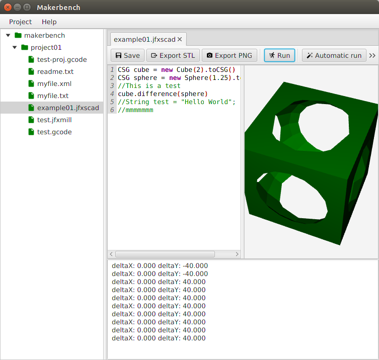
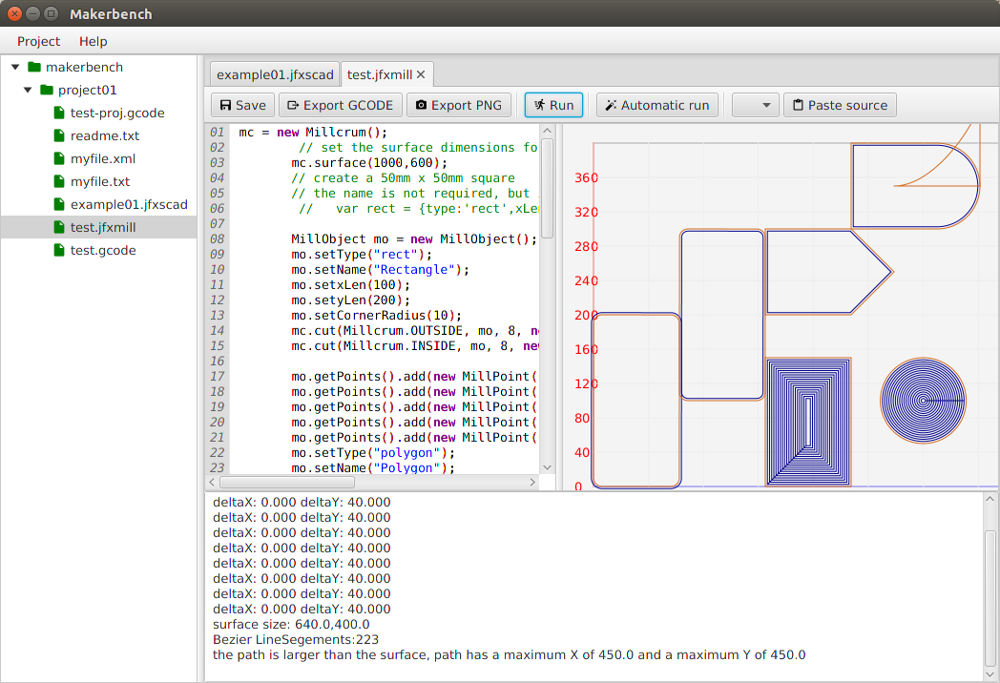
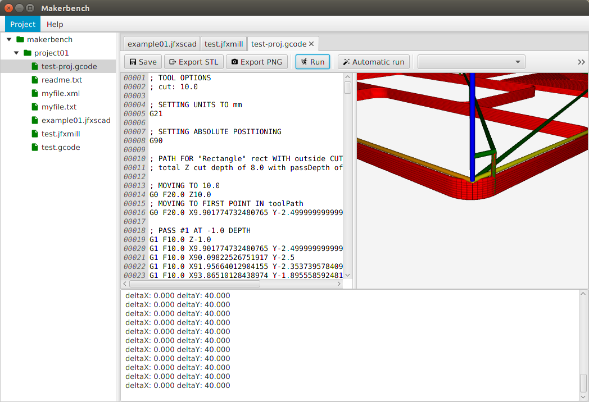

# makerbench
Makerbench IDE, the swiss armyknife for the maker.

WARNING: work in progress, so don't use this yet !!!

Runs on any JavaFX supported system: Linux, Windows, Mac, Raspberry PI, ...
Needs Java V8.40 or higher.

Includes support for :

-  3D modelling using JFXSCAD (Openscad style) 
-  2D CNC path generation using JFXMILL (Millcrum stytle)
-  3D GCode viewer, ...
-  xml editor
-  text editor

Planned:

-  3D Slicer support (backport original reprap slicer + external jPython slicers)
-  GCode sender 3D printer (makerbot firmware compatible, others ?)
-  GCode sender 2D CNC mill
-  Arduino editor & code sender
-  Gerber support
-  Colinbus cnc support
-  MarkDown editor / preview

## Screenshots

-  JFXSCAD
 

-  JFXMILL

-  GCODE Viewer

## Copyright

	Copyright 2015 - 2016, Luc De pauw - Makercafe.be
	Licensed under GNU GPLV3
	
	Makerbench is free software: you can redistribute it and/or modify
	it under the terms of the GNU General Public License as published by
	the Free Software Foundation, either version 3 of the License, or
	(at your option) any later version.
	
	Makerbench is distributed in the hope that it will be useful,
	but WITHOUT ANY WARRANTY; without even the implied warranty of
	MERCHANTABILITY or FITNESS FOR A PARTICULAR PURPOSE.  See the
	GNU General Public License for more details.
	
	You should have received a copy of the GNU General Public License
	along with Makerbench.  If not, see <http://www.gnu.org/licenses/>.

